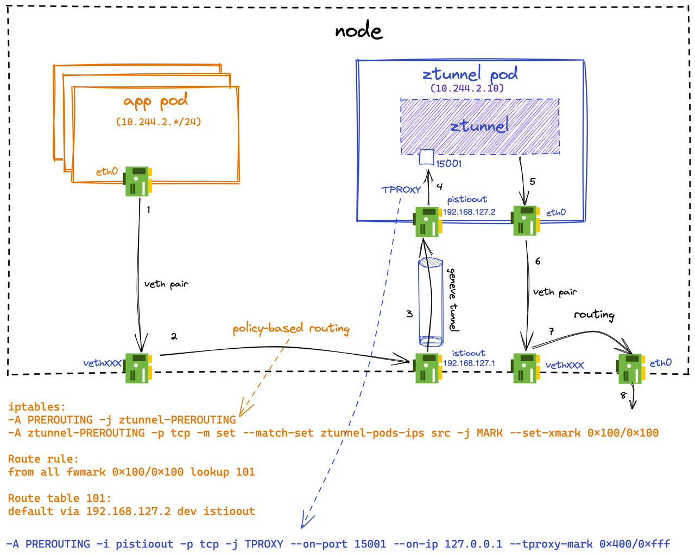

# ambient(offMesh version) notes

## How to Use
### CNI
This version of ambient needs to be used in conjunction with `kindnet`(offmesh version).
[kindnet(offMesh version)](https://github.com/He-Jingkai/kindnet)
Because of the unequal role of each node in the cluster, before applying `kindnet` cni, you need to create a configmap containing cluster information to illustrate the role and relationship of each node.
```shell
kubectl create configmap offmesh-conf -n kube-system --from-file=$(pwd)/offmesh-conf
```
You need to first create a directory named `offmesh-conf`, which should contain a yaml file named `cluster-conf.yaml`, the content of the file is similar to [this sample file](./cluster-conf.yaml).

This configmap will be mounted as a volume on the `kindnetd` pod of each node.

### before installation
Like kindnet, you need to create a configmap for ambient that contains the above information.
```shell
kubectl create configmap offmesh-conf -n istio-system --from-file=$(pwd)/offmesh-conf
```
In order to facilitate the scheduling of the kubernetes control plane, you need to use the following instructions to mark the identity of each node.
```shell
#cpu 
kubectl label nodes "$CPUNodeName" offMeshNodeType=cpu
#dpu
kubectl label nodes "$DPUNodeName" offMeshNodeType=dpu
```

### installation and enabling
Use the following command to install ambient.
```shell
./istioctl install --set profile=ambient
```
Use the following command to add the namespace to ambient management.
```shell
kubectl label namespace default istio.io/dataplane-mode=ambient
```

## System Structure Overview
### Prototype System Structure
TODO: explanation
#### inbound taffic

TODO: explanation
#### outbound traffic

TODO: explanation

### CNI network
The role of ztunnel in ambient is a transparent proxy, that is, the source IP and destination IP of the network packet do not change before and after ztunnel processing. Therefore, it is impossible to judge whether the network packet has been processed by ztunnel only from the content of the network packet itself. In the initial ambient architecture, the system uses the source interface (veth) of the network packet to distinguish whether the network packet has been processed. However, after the ztunnel is offloaded to the dpu, the network packets that have been processed by the ztunnel or have not been processed will enter the node from the physical network interface of the node, and it is impossible to tell whether the network packet needs to be forwarded to the dpu on the cpu node for ztunnel processing. Therefore, we need to limit the flow of network packets to avoid the need for CPU nodes to make such judgments.

The design of cni is as follows. We require that the packets entering the cpu node will be routed to the corresponding dpu node first, and the network packets on the dpu will be processed by ztunnel, and then routed from the dpu node to the cpu node. In this way, all inbound packets entering the CPU node are processed by ztunnel.

The firewall of linux will filter the return packets whose routing path are different from the routing path of the incoming packets, which will cause the tcp connection to fail. In order to solve this problem, we require the network packets sent from the CPU to be routed to the DPU first, and then the DPU will do the next routing.

In short, the dpu node is the proxy of the incoming and outgoing traffic of its cpu node.As shown in the diagram below.


For example, the related routing rule for a cpu node is:
```
10.244.0.0/24 is the cpu node(192.168.50.130)'s subnet
10.244.1.0/24 is the cpu node's dpu node(192.168.50.131)'s subnet 
10.244.3.0/24 is another cpu node(192.168.50.133)'s subnet 
10.244.4.0/24 is another cpu node's dpu node(192.168.50.128)'s subnet 
```

```shell
$ ip route show table main
10.244.1.0/24 via 192.168.50.131 dev ens32 
10.244.2.0/24 via 192.168.50.131 dev ens32 
10.244.3.0/24 via 192.168.50.131 dev ens32 
```
The routing rule of its dpu node is
```shell
$ ip route show table main
10.244.0.0/24 via 192.168.50.130 dev ens32 
10.244.2.0/24 via 192.168.50.128 dev ens32 
10.244.3.0/24 via 192.168.50.128 dev ens32 
```
### ambient network
We need to use different network rules on the dpu and cpu nodes. The network rules on the CPU node are responsible for forwarding the outbound traffic of this node to the dpu node, but not forwarding the network traffic sent to the cpu node after being processed by the dpu node. The network rules on the DPU node are responsible for forwarding the inbound and outbound traffic entering the dpu node to the corresponding port of the ztunnel pod, and sending the traffic processed by the ztunnel to the corresponding destination.

We used the same network rules as the prototype system on the dpu nodes. On the cpu node, we use the following network rules (the meaning of the corresponding network rules is described in the comments).

The workflow of the network package in the system is shown in the figure below.The setting and dynamic update of network rules are implemented by the `istio-cni-node` pod on the corresponding node, which runs in host network mode.


```shell
$ iptable-save
*mangle
:ztunnel-FORWARD - [0:0]
:ztunnel-INPUT - [0:0]
:ztunnel-OUTPUT - [0:0]
:ztunnel-POSTROUTING - [0:0]
:ztunnel-PREROUTING - [0:0]
-A PREROUTING -j ztunnel-PREROUTING
-A INPUT -j ztunnel-INPUT
-A FORWARD -j ztunnel-FORWARD
-A OUTPUT -j ztunnel-OUTPUT
-A POSTROUTING -j ztunnel-POSTROUTING
# The connection of connections for DNS will be skipped
-A ztunnel-FORWARD -m mark --mark 0x220/0x220 -j CONNMARK --save-mark --nfmask 0x220 --ctmask 0x220
-A ztunnel-INPUT -m mark --mark 0x220/0x220 -j CONNMARK --save-mark --nfmask 0x220 --ctmask 0x220
# The pockets sent by host will be skipped
-A ztunnel-OUTPUT -s 10.244.0.1/32 -j MARK --set-xmark 0x220/0xffffffff
# The return pockets for DNS will be skipped
-A ztunnel-PREROUTING -m connmark --mark 0x220/0x220 -j MARK --set-xmark 0x200/0x200
-A ztunnel-PREROUTING -m mark --mark 0x200/0x200 -j RETURN
# The connection of pockets processed by dpu will be skipped
-A ztunnel-PREROUTING -i ens32 -m set --match-set ztunnel-pods-ips dst -j MARK --set-xmark 0x200/0x200
# The pockets for DNS will be skipped
-A ztunnel-PREROUTING -p udp -j MARK --set-xmark 0x220/0x220
-A ztunnel-PREROUTING -m mark --mark 0x200/0x200 -j RETURN
# The outbound pockets will be policy routed
-A ztunnel-PREROUTING -p tcp -m set --match-set ztunnel-pods-ips src -j MARK --set-xmark 0x100/0x100
COMMIT

$ ip rule
0:      from all lookup local
100:    from all fwmark 0x200/0x200 goto 32766
101:    from all fwmark 0x100/0x100 lookup 101
32766:  from all lookup main
32767:  from all lookup default

$ ip route show table 101
default via 192.168.50.131 dev ens32 
```
### ambient xDS
xDS is used to distribute configuration information to ztunnel, including listener discovery service (LDS), route discovery service (RDS), cluster discovery service (CDS), endpoint discovery service (EDS), secret discovery service (SDS). In order to realize ztunnel offloading, we need to analyze and modify the xDS server in istiod to distribute the configuration information corresponding to the workload on the cpu node to the ztunnel on the dpu node.